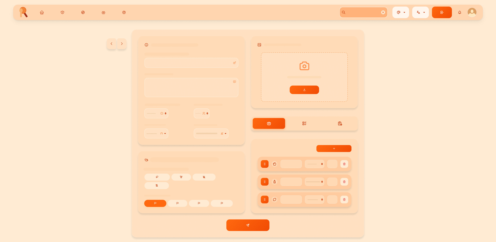

<h1 align="center">
   🥄 Rarecips
</h1>

   

   
   
   
   
   
   
   
   
   
   
   
   
   
   
   
   
   
   
   
   
   
   
   
   

## 📝 Summary

Rarecips is a progressive web application designed to help users discover, share, and manage unique and rare recipes from around the world. The platform allows users to browse, upload, review, and save recipes, fostering a community of culinary enthusiasts.

## ✏️ Mockup

   

NOTE: The project is currently in the requirements and design phase: **only functional and technical objectives have been defined, thus implementation has not started yet.**

## 🎯 Objectives

### Functional Objectives
The platform provides users full control over the content they're allowed to see, upload and modify.

- User registration and authentication
- User profile management
- Stat tracking
- User and content moderation
- Recipe browsing with search and filtering
- Recipe visualization
- Recipe sharing through media and format enriched text powered uploading
- Recipe reviewing and rating
- Recipe saving and bookmarking
- Health report feedbacking

### Technical Objectives
Modern, scalable, maintainable and continous-deployment supported architecture using the newest technologies and best practices.

- Frontend: Angular + Tailwind CSS
- Backend: Spring Boot (Java)
- Database: MySQL
- RESTful API design
- Dockerized deployment
- CI/CD with GitHub Actions
- Automated testing (unit/integration)
- Websocket implementation
- Cloud deployment
- Static analysis

## 🛠️ Methodology

The project will follow an agile, iterative, and incremental development process:

- **Phase 1 (15/07/2025 - 15/09/2025):** Requirement and feature definition ([Objectives](#objectives), [Detailed Features](#detailed-features))
- **Phase 2 (15/09/2025 - 15/10/2025):** Technology and tool configuration with quality controls
- **Phase 3 (15/10/2025 - 15/12/2025):** Basic features, application dockerization
- **Phase 4 (15/12/2025 - 01/03/2026):** Medium features
- **Phase 5 (01/03/2026 - 15/04/2026):** Intricate features
- **Phase 6 (15/04/2026 - 15/05/2026):** Final report
- **Phase 7 (15/05/2026 - 15/06/2026):** Project presentation

   

## 🧩 Detailed Features

### Basic
- User registration and authentication (All users)
- Recipe browsing with search and filtering (All users)
- Recipe visualization (All users)

### Intermediate
- Recipe sharing through media and format enriched text powered uploading (Registered users)
- Recipe reviewing and rating (Registered users)
- User profile management (Registered users)
- Recipe saving and bookmarking (Registered users)
- Health report feedbacking (Registered users)
- Stat tracking (Registered users)

### Intricate
- User and content moderation (Admins)
- Analytics dashboard viewing (Admins)
- Personalized recommendations (Registered users)

## 🔍 Analysis

### Screens & Navigation

   

#### Landing Page
The main entry point of the application, showcasing featured recipes, collections, etc. and allowing users to explore the platform.
###### Pages that can be accessed from here:
- Login
- Signup
- Admin
- Ingredients
- Health
- Explore
- Profile
- Recipe
---

   

#### Authentication - Login
User login screen with email/username and password authentication.
###### Pages that can be accessed from here:
- Signup
- Landing
---

   

#### Authentication - Sign Up
User registration screen for creating new accounts with profile information.
###### Pages that can be accessed from here:
- Login

---

   

#### Explore
Browse and search through all available recipes, users, ingredients and collections with filtering capabilities.
###### Pages that can be accessed from here:
- Landing
- Login
- Signup
- Admin
- Ingredients
- Health
- Profile
- Recipe
---

   

#### Recipe View
Detailed view of individual recipes showing ingredients, instructions, and user reviews.
###### Pages that can be accessed from here:
- Login
- Signup
- Admin
- Ingredients
- Health
- Explore
- Profile
---

   

#### Recipe Editor
Create and edit recipes with rich text formatting and media upload capabilities.
###### Pages that can be accessed from here:
- Login
- Signup
- Admin
- Ingredients
- Health
- Explore
- Profile
---

   

#### Profile
Display user information, statistics, and personal recipe collections.
###### Pages that can be accessed from here:
- Login
- Signup
- Admin
- Ingredients
- Health
- Explore
- Recipe
---

   

#### Profile Edit
Edit user profile information, preferences, and account settings.
###### Pages that can be accessed from here:
- Login
- Signup
- Admin
- Ingredients
- Health
- Explore
- Profile
---

   

#### Ingredients
Manage and browse ingredient database with nutritional information.
###### Pages that can be accessed from here:
- Login
- Signup
- Admin
- Health
- Explore
- Profile
---

   

#### Health Reports
View personalized health and nutrition reports based on recipe consumption.
###### Pages that can be accessed from here:
- Login
- Signup
- Admin
- Ingredients
- Explore
- Profile
---

   

#### Admin Panel
Administrative dashboard for content moderation and system analytics (Admin users only).
###### Pages that can be accessed from here:
- Login
- Signup
- Admin
- Ingredients
- Health
- Explore
- Profile
---

   

#### Error Page
Custom error page for handling various application errors gracefully.
###### Pages that can be accessed from here:
- Login
- Signup
- Admin
- Ingredients
- Health
- Explore
- Profile
---

   

### Entities
- **User:** username, display name, bio, profile image, email, password, role, creation date, last online date
- **Recipe:** id, label, image, people, ingredients, difficulty, dish types, meal types, cuisine type, diet labels, health labels, cautions, time, weight, calories, average rating, author, reviews, creation date, modification date
- **Review:** id, recipe, rating, comment, author, creation date, modification date
- **Ingredient** id, description, quantity, measure, weight
- **Report** id, user, details

### User Permissions
- **Unregistered:** Browse, view recipes
- **Registered:** Unregistered user permissions, recipe CRUD, profile CRUD, report querying, user stats
- **Admin:** Registered user permissions, content and user moderation, system analytics viewing

### Images
- Recipes: Multiple images per recipe, with images in ingredients
- Users: Avatar image

### Charts
- Registered personal stats: Bar and pie charts for own user's content and profile
- Admin dashboard: Bar and pie charts for recipe stats, user activity

### Complementary Technology
- Docker for deployment
- GitHub Actions for CI/CD
- ...

### Advanced Algorithm/Query
- Personalized recipe recommendations based on user preferences and activity

## 📈 Project Tracking

- [GitHub Project Board](https://github.com/codeurjc-students/2025-Rarecips/projects)
- [Development Blog](https://medium.com/)

## 👤 Author

This application is developed as part of the Final Degree Project (TFG) for the Computer Engineering degree at ETSII, Universidad Rey Juan Carlos.

- **Student:** Blas Vita Ramos ([b.vita.2020@alumnos.urjc.es](mailto:b.vita.2020@alumnos.urjc.es))
- **Supervisor:** Michel Maes Bermejo ([michel.maes@urjc.es](michel.maes@urjc.es))
