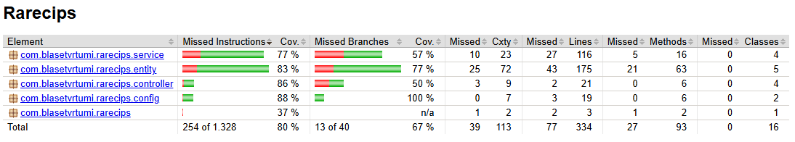

# 👨‍💻 Development Guide

## 📋 Table of Contents

- [Introduction](#introduction)
- [Technologies](#technologies)
- [Tools](#tools)
- [Architecture](#architecture)
- [Quality Control](#quality-control)
- [Development Process](#development-process)
- [Code Execution and Editing](#code-execution-and-editing)

## Introduction

### Architecture Overview

Rarecips is a Single Page Application (SPA) web application that follows a three-tier architecture consisting of:

- **Client (Frontend):** Angular dynamic SPA providing the user interface
- **Server (Backend):** Spring Boot REST API that handles business logic and data processing
- **Database:** MySQL database for persistent data storage

Angular will serve SPA content dynamically by displaying data obtained through backend API requests, which load
information from database.

### Architecture Summary

| Aspect                  | Details                                                   |
|-------------------------|-----------------------------------------------------------|
| **Type**                | Web SPA with REST API                                     |
| **Technologies**        | Angular, TypeScript, Java, Spring Boot, MySQL, Docker     |
| **Tools**               | VSCode, WebStorm, Postman, Maven, npm, Docker, Git        |
| **Quality Control**     | Unit testing (JUnit), Integration testing, System testing 
| **Deployment**          | Docker containers, CI/CD with GitHub Actions              |
| **Development Process** | Iterative and incremental, Git workflow, DevOps practices |

## Technologies

### Frontend Technologies

#### Angular (https://angular.io/)

Modern TypeScript-based framework for building scalable single-page applications. Used for creating the entire user
interface and managing client-side routing, state management, and user interactions.

### Backend Technologies

#### Spring Boot (https://spring.io/projects/spring-boot)

Java-based framework for building production-ready applications with minimal configuration. Used for creating REST APIs,
handling business logic, security, and data persistence.

#### Java (https://www.oracle.com/java/)

Object-oriented programming language used for backend development, providing robustness, security, and platform
independence.

#### MySQL (https://www.mysql.com/)

Relational database management system used for storing application data including users, recipes, reviews, and
ingredients.

### Infrastructure Technologies

#### Docker (https://www.docker.com/)

Containerization platform used for packaging the application and its dependencies into lightweight, portable containers
for consistent deployment across environments.

#### GitHub Actions (https://github.com/features/actions)

CI/CD platform integrated with GitHub for automating testing, building, and deployment workflows.

## Tools

### Development Environments

#### Visual Studio Code (https://code.visualstudio.com/)

Lightweight code editor used primarily for frontend development with Angular and TypeScript, offering excellent
extensions for web development.

#### WebStorm (https://www.jetbrains.com/webstorm/)

Professional IDE used for advanced JavaScript/TypeScript development, providing intelligent code assistance and
debugging capabilities.

#### IntelliJ IDEA (https://www.jetbrains.com/idea/)

Professional Java IDE used for backend development with Spring Boot, offering advanced code analysis and debugging
tools.

### Build and Package Management

#### Maven (https://maven.apache.org/)

Build automation and project management tool used for managing Java dependencies, compiling, testing, and packaging the
Spring Boot application.

#### npm (https://www.npmjs.com/)

Package manager for Node.js used for managing frontend dependencies and running build scripts for the Angular
application.

### Version Control and Collaboration

#### Git (https://git-scm.com/)

Distributed version control system used for tracking code changes and collaboration.

#### GitHub (https://github.com/)

Cloud-based Git repository hosting service used for code storage, issue tracking, and project management.

## AI Usage

Generative AI tools have been used as a complementary material for tasks such as documentation, consulting, automation
of processes, optimization, testing and feedback.

#### Research and feedback:

- Perplexity
- Gemini
- ChatGPT

#### Autocompletion, prediction, optimization, testing and code generation

- Github Copilot

## Architecture

### Deployment Architecture

```
┌─────────────────┐    HTTP/HTTPS    ┌─────────────────┐    JDBC    ┌─────────────────┐
│   Angular SPA   │ ──────────────→  │  Spring Boot    │ ────────→  │     MySQL       │
│   (Frontend)    │                  │   (Backend)     │            │   (Database)    │
│   Port: 4200    │ ←──────────────  │   Port: 8443    │            │   Port: 3306    │
└─────────────────┘    REST API      └─────────────────┘            └─────────────────┘
```

**Communication Protocols:**

- Frontend ↔ Backend: HTTP/HTTPS REST API + WebSockets for real-time notifications
- Backend ↔ Database: JDBC connections for data persistence

### REST API Documentation

The complete API documentation is available in OpenAPI format and can be viewed
at [Rarecips API Documentation](https://raw.githack.com/codeurjc-students/2025-Rarecips/main/docs/api/api-docs.html)

## Quality Control

### Automated Testing

#### Frontend Testing

- **Framework:** Selenium + JUnit
- **Types:** Unit tests for components and services, Integration tests for user workflows, System tests for UI
- **Applies to:** Recipes

#### Backend Testing

- **Framework:** JUnit 5 and Spring Boot Test
- **Types:** Unit tests for services and repositories, Integration tests for REST endpoints, System tests for database
- **Applies to:** Recipes

#### Test Statistics

- **Coverage**:

    

*Test metrics will be updated as development progresses*

## Development Process

### Agile Methodology

The project follows an iterative and incremental development process based on Agile principles and incorporating best
practices from Extreme Programming (XP) and Kanban methodologies.

#### Task Management

- **GitHub Issues:** Used for tracking bugs, features, and improvements
- **GitHub Projects:** Kanban-style board for visual task management and sprint planning
- **Labels and Milestones:** Organized by priority, type, and development phases

#### Git Workflow

- **Repository:** Single repository with frontend and backend code
- **Branching Strategy:** Feature branches with pull requests for code review
- **Pull Requesting:** Used for safe merging into main branch to add functional features
- **Commit Standards:** Conventional commits for automated changelog generation

*Git metrics will be updated as development progresses*

#### Continuous Integration

GitHub Actions workflows automate:

- **Build Verification:** Compile and package both frontend and backend
- **Automated Testing:** Run unit and integration tests on pull requests

## Code Execution and Editing

### Repository Setup

```bash
# Clone the repository
git clone https://github.com/codeurjc-students/2025-Rarecips.git
cd 2025-Rarecips
```

### Execution

#### Prerequisites

- Java 21+
- Node.js 18+
- Docker and Docker Compose
- MySQL 9.0+ (or use Docker)

#### Database Setup

```bash
# Using Docker (recommended)
docker-compose up -d mysql

# Or manually configure MySQL with:
# Database: rarecips
# Username: root
# Password: Ask for permission to access repository secret
```

#### Backend Execution

```bash
cd backend
# Install dependencies and run
mvn spring-boot:run

# Backend will be available at http://localhost:8443
```

#### Frontend Execution

```bash
cd frontend
# Install dependencies
npm install

# Start development server
ng serve
start http://localhost:4200
```

#### Full Application Access

- **Web Application:** http://localhost:4200
- **API Endpoint:** http://localhost:4200/api
- **API Documentation:** http://localhost:8443/swagger-ui.html
- **Database:** http://localhost:3306 (if using local MySQL)

### Development Tools Usage

#### IDE Configuration

- **Angular Development:** Use VSCode/WebStorm with Angular Language Service extension
- **Spring Boot Development:** Use IntelliJ IDEA or VSCode with Java extensions
- **Database Management:** Use MySQL Workbench or DBeaver

#### API Testing

- **Tool:** Postman
- **Collection:** Can be created through importing
  of [this](https://github.com/codeurjc-students/2025-Rarecips/blob/main/docs/api/Rarecips-API.postman_collection.json)
  file

### Testing Execution

```bash
# Frontend tests
cd frontend
npm run build &
cd ../backend
mvn test -Dtest="frontend.*Test"

# Backend tests
cd backend
mvn test -Dtest="backend.*Test"
mvn verify
```

### Creating a Release

```bash
# Frontend build
cd frontend
ng build --prod

# Backend package
cd backend
mvn clean package

# Docker images
docker-compose build

# Create release tag
git tag -a v0.1 -m "Release name"
git push origin v0.1
```
