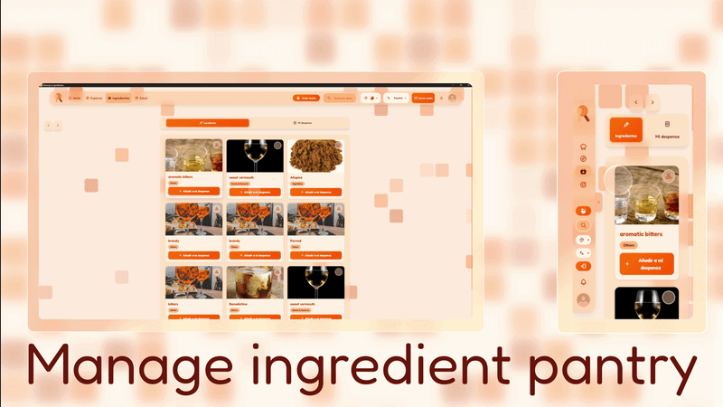

# 🧩 Features

- ## Feature List
  - **0.1**:
    - Explore: Any user can browse through recipes, ingredients, collections and users with powerful filters and search queries.
    

      
    

    - Customize: New appearance and language preferences can now be cuztomized locally.
    

      
    

    - Authenticate: Now users can create accounts and log in to access personalized features.
    

      
    

    - Manage favorites and collections: Registered users are able to save their favorite recipes and create recipe collections.
    

      
    

    - Review and rate: Registered users can review and rate any recipes.
    

      
    

    - Manage ingredient pantry: Registered users can manage their ingredient pantry, adding any ingredient they have at home. This allows for a personalized experience that will be used in the future to provide personalized recommendations.
    

      
    

    - Add new recipes: Registered users can create new recipes with detailed information and images.
    

      
    

    - Modify profile: Registered users can modify their correspondingly allowed profile information, profile visibility and profile deletion.
    

      
    

    - Ingredient management: Only administrators can add, modify and delete ingredients to be displayed to and used by all users.
    

      
    

 - ## Detailed Functionality

    ### Basic
    
    - User registration and authentication (All users) 
      - Recipe browsing with search and filtering (All users) ✔️
      - Recipe visualization (All users) ✔️
    
    ### Intermediate
    
    - Recipe sharing through media and format enriched text powered uploading (Registered users)
      - Recipe reviewing and rating (Registered users) ✔️
      - User profile management (Registered users) ✔️
      - User ingredient list management (registered users) ✔️
      - Recipe saving and bookmarking (Registered users) ✔️
    
    ### Intricate
    
    - User and content moderation (Admins)
      - User notifications through websockets (Registered users) ❌
      - Analytics dashboard viewing (Admins) ❌
      - Health report feedbacking (Registered users) ❌
      - Stat tracking (Registered users) ❌
      - Personalized recommendations (Registered users) ❌
