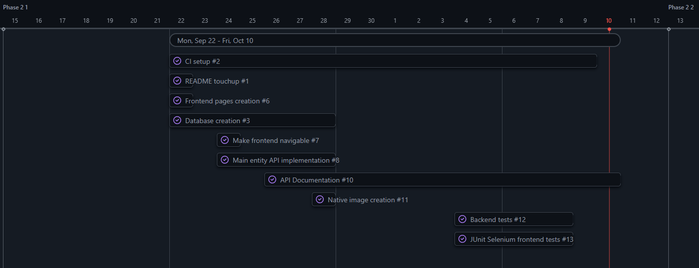
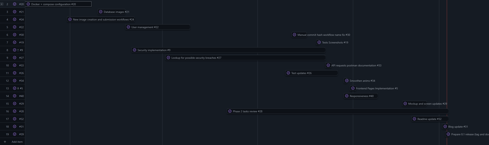
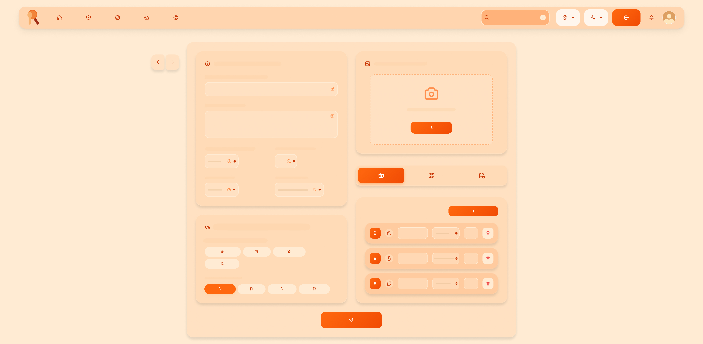
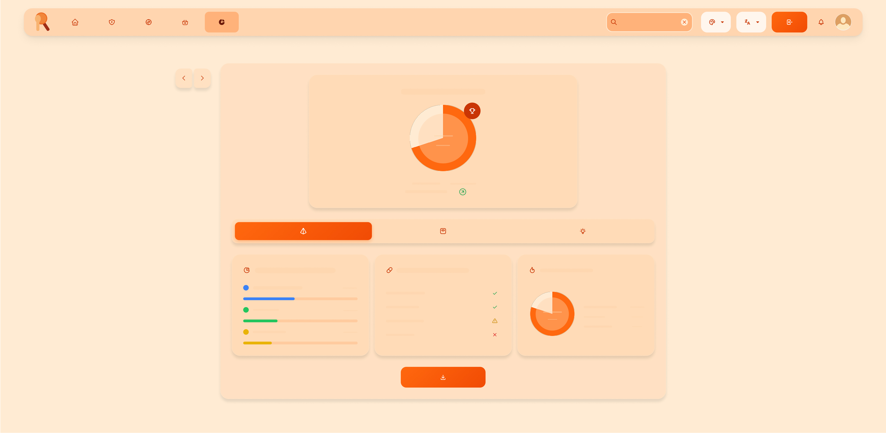
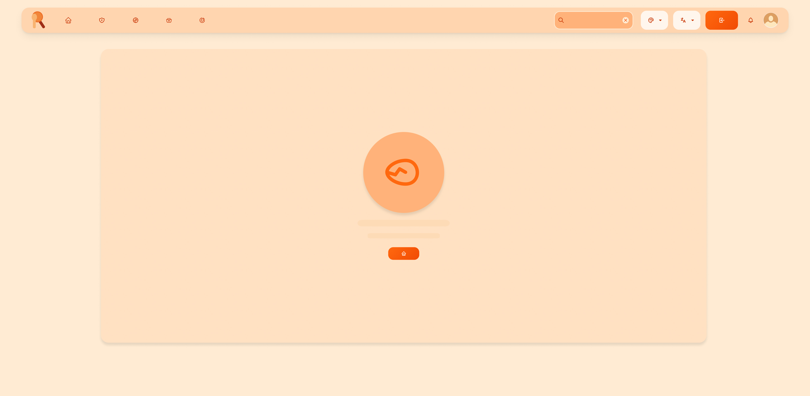

# 🚀 Project Start-up

## 🎯 Objectives

### Functional Objectives

The platform provides users full control over the content they're allowed to see, upload and modify.

- User registration and authentication
- User profile management
- User notifications
- User ingredient list management
- Stat tracking
- User and content moderation
- Recipe browsing with search and filtering
- Recipe visualization
- Recipe sharing through media and format enriched text powered uploading
- Recipe reviewing and rating
- Recipe saving and bookmarking
- Health report feedbacking: Registered users can check health statistics based off their liked recipes simulating a
  consumption analysis

### Technical Objectives

Modern, scalable, maintainable and continuous-deployment supported architecture using the newest technologies and best
practices.

- Frontend: Angular + Tailwind CSS
- Backend: Spring Boot (Java)
- Database: MySQL
- RESTful API design
- Dockerized deployment
- CI/CD with GitHub Actions
- Automated testing (unit/integration)
- Websocket implementation
- Cloud deployment
- Static analysis

## 🛠️ Methodology

The project will follow an agile, iterative, and incremental development process:

- **Phase 1 (15/07/2025 - 15/09/2025):** Requirement and feature
  definition ([Objectives](objectives.md), [Detailed Features](features.md))
- **Phase 2 (15/09/2025 - 15/10/2025):** Technology and tool configuration with quality controls

   

- **Phase 3 (15/10/2025 - 15/12/2025):** Basic features, application dockerization

   

- **Phase 4 (15/12/2025 - 01/03/2026):** Medium features
- **Phase 5 (01/03/2026 - 15/04/2026):** Intricate features
- **Phase 6 (15/04/2026 - 15/05/2026):** Final report
- **Phase 7 (15/05/2026 - 15/06/2026):** Project presentation

## 🔍 Analysis

- [Screens & Navigation](https://github.com/codeurjc-students/2025-Rarecips/blob/main/docs/sections/analysis.md#screens--navigation)
    - [Landing Page](https://github.com/codeurjc-students/2025-Rarecips/blob/main/docs/sections/analysis.md#landing-page)
    - [Authentication - Login](https://github.com/codeurjc-students/2025-Rarecips/blob/main/docs/sections/analysis.md#authentication---login)
    - [Authentication - Signup](https://github.com/codeurjc-students/2025-Rarecips/blob/main/docs/sections/analysis.md#authentication---signup)
    - [Explore](https://github.com/codeurjc-students/2025-Rarecips/blob/main/docs/sections/analysis.md#explore)
    - [Recipe View](https://github.com/codeurjc-students/2025-Rarecips/blob/main/docs/sections/analysis.md#recipe-view)
    - [Recipe Edit](https://github.com/codeurjc-students/2025-Rarecips/blob/main/docs/sections/analysis.md#recipe-edit)
    - [Profile View](https://github.com/codeurjc-students/2025-Rarecips/blob/main/docs/sections/analysis.md#profile-view)
    - [Profile Edit](https://github.com/codeurjc-students/2025-Rarecips/blob/main/docs/sections/analysis.md#profile-edit)
    - [Ingredients](https://github.com/codeurjc-students/2025-Rarecips/blob/main/docs/sections/analysis.md#ingredients)
    - [Health Reports](https://github.com/codeurjc-students/2025-Rarecips/blob/main/docs/sections/analysis.md#health-reports)
    - [Admin Panel](https://github.com/codeurjc-students/2025-Rarecips/blob/main/docs/sections/analysis.md#admin-panel)
    - [Error Page](https://github.com/codeurjc-students/2025-Rarecips/blob/main/docs/sections/analysis.md#error-page)
- [Entities](https://github.com/codeurjc-students/2025-Rarecips/blob/main/docs/sections/analysis.md#entities)
- [User Permissions](https://github.com/codeurjc-students/2025-Rarecips/blob/main/docs/sections/analysis.md#user-permissions)
- [Images](https://github.com/codeurjc-students/2025-Rarecips/blob/main/docs/sections/analysis.md#images)
- [Charts](https://github.com/codeurjc-students/2025-Rarecips/blob/main/docs/sections/analysis.md#charts)
- [Complementary Technology](https://github.com/codeurjc-students/2025-Rarecips/blob/main/docs/sections/analysis.md#complementary-technology)
- [Advanced Algorithm/Query](https://github.com/codeurjc-students/2025-Rarecips/blob/main/docs/sections/analysis.md#advanced-algorithmquery)
- [Optional Addons](https://github.com/codeurjc-students/2025-Rarecips/blob/main/docs/sections/analysis.md#optional-addons)

### Screens & Navigation

   

### Landing Page

The main entry point of the application, showcasing featured recipes, collections, etc. and allowing users to explore
the platform.

#### Pages that can be accessed from here:

- Login, Signup, Admin, Ingredients, Health, Explore, Profile, Recipe

   

### Authentication - Login

User login screen with email/username and password authentication.

#### Pages that can be accessed from here:

- Signup, Landing

   

###Authentication - Signup

User registration screen for creating new accounts with profile information.

#### Pages that can be accessed from here:

- Login

   

### Explore

Browse and search through all available recipes, users, ingredients and collections with filtering capabilities.

#### Pages that can be accessed from here:

- Landing, Login, Signup, Admin, Ingredients, Health, Profile, Recipe

   

### Recipe View

Detailed view of individual recipes showing ingredients, instructions, and user reviews.

#### Pages that can be accessed from here:

- Login, Signup, Admin, Ingredients, Health, Explore, Profile

   

### Recipe Edit

Create and edit recipes with rich text formatting and media upload capabilities.

#### Pages that can be accessed from here:

- Login, Signup, Admin, Ingredients, Health, Explore, Profile

   

### Profile View

Display user information, statistics, and personal recipe collections.

#### Pages that can be accessed from here:

- Login, Signup, Admin, Ingredients, Health, Explore, Recipe

   

### Profile Edit

Edit user profile information, preferences, and account settings.

#### Pages that can be accessed from here:

- Login, Signup, Admin, Ingredients, Health, Explore, Profile

   

### Ingredients

Manage and browse ingredient database with nutritional information.

#### Pages that can be accessed from here:

- Login, Signup, Admin, Health, Explore, Profile

   

### Health Reports

View personalized health and nutrition reports based on recipe consumption.

#### Pages that can be accessed from here:

- Login, Signup, Admin, Ingredients, Explore, Profile

   

### Admin Panel

Administrative dashboard for content moderation and system analytics (Admin users only).

#### Pages that can be accessed from here:

- Login, Signup, Admin, Ingredients, Health, Explore, Profile

   

### Error Page

Custom error page for handling various application errors gracefully.

#### Pages that can be accessed from here:

- Login, Signup, Admin, Ingredients, Health, Explore, Profile

   

### Entities

- **User:** username, display name, bio, profile image, email, password, role, creation date, last online date
- **Recipe:** id, label, image, people, ingredients, difficulty, dish types, meal types, cuisine type, diet labels,
  health labels, cautions, time, weight, calories, average rating, author, reviews, creation date, modification date
- **Review:** id, recipe, rating, comment, author, creation date, modification date
- **Collection:** id, name, isFavorites, recipes, author, creation date, modification date
- **Ingredient** id, description, quantity, measure, weight

### User Permissions

|                                   | Unregistered | Registered | Admin |
|-----------------------------------|:------------:|:----------:|:-----:|
| Browse, search and filter recipes |      ✓       |     ✓      |   ✓   |
| View recipes                      |      ✓       |     ✓      |   ✓   |
| View profiles                     |      ✓       |     ✓      |   ✓   |
| View collections                  |      ✓       |     ✓      |   ✓   |
| View reviews                      |      ✓       |     ✓      |   ✓   |
| View ingredients                  |      ✓       |     ✓      |   ✓   |
| Full Recipe CRUD                  |              |     ✓      |   ✓   |
| Full Profile CRUD                 |              |     ✓      |   ✓   |
| Full Collection CRUD              |              |     ✓      |   ✓   |
| Full Review CRUD                  |              |     ✓      |   ✓   |
| Report querying                   |              |     ✓      |   ✓   |
| User stats                        |              |     ✓      |   ✓   |
| Ingredient CRUD                   |              |            |   ✓   |
| Content moderation                |              |            |   ✓   |
| User moderation                   |              |            |   ✓   |
| System analytics viewing          |              |            |   ✓   |

### Images

- Recipes: Multiple images per recipe, with images in ingredients
- Users: Avatar image

### Charts

- Registered personal stats: Bar and pie charts for own user's content and profile
- Admin dashboard: Bar and pie charts for recipe stats, user activity

### Complementary Technology

- Notifications through websockets
- Recipe exporting to PDF
- User lists batch importing/exporting

### Advanced Algorithm/Query

- Personalized recipe recommendations based on user preferences and activity

### Optional Addons

- Automated testing
- Native Image Packaging
- Cloud Deployment (app, database)
- Continuous Deployment
- WebSockets as Rest-complementary communication technology
- Responsive mobile design
